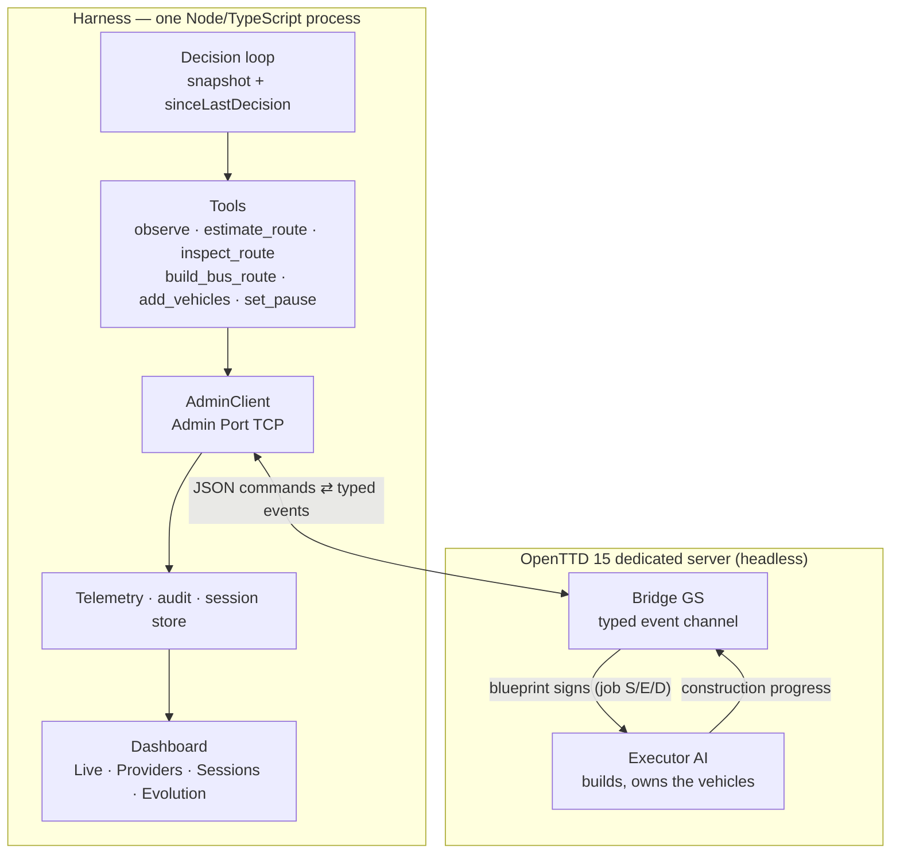

# openttd-agent

**English** · [简体中文](README.zh-CN.md)

[](LICENSE)


> An LLM agent that plays OpenTTD — and is built so it can learn from the game itself.
>
> The harness supplies **facts, causality and protocol**. It never supplies strategy:
> every plan in a run is the model's own.

This file answers one question: **how do I use this?** Its boundary is set by
`AGENTS.md` §9 (the responsibility table) — system facts live in
[`SPEC.md`](SPEC.md), progress and next steps in [`ROADMAP.md`](ROADMAP.md), version
history in [`CHANGELOG.md`](CHANGELOG.md), process lessons in [`MEMORY.md`](MEMORY.md).
Nothing below duplicates them; it points.

---

## Why it is built the way it is

OpenTTD is a continuous simulation (tick-driven); an LLM is slow, discrete reasoning
(one decision per 1–30 s). Everything else follows from that mismatch:

- **The model gets tools, not puppet strings.** It observes, estimates, orders a line,
  manages the fleet — through tools whose results it can read back.
- **An in-game AI is the hands.** The Admin Port can pause, save and start scripts; it
  cannot lay track. So a Bridge Game Script and an Executor AI live inside the game, and
  the harness drives them over the Admin Port.
- **The world keeps running while the model thinks.** Instead of freezing the game, each
  decision receives a snapshot plus a report of everything that changed since the last
  one, so the model can see the effects of its own actions.

## Architecture



Two facts worth remembering before reading the code (details in `SPEC.md` §10):

1. **RCON cannot play the game.** It does server-level work only — pause, save, `say`,
   `start_ai`. Building roads, stations and vehicles needs the in-game Squirrel APIs,
   which is why the Executor AI exists.
2. **Every decision is queued, not assumed.** Commands travel model → harness → GS →
   Executor, and the Executor applies them in submission order (FIFO). A slow decision
   therefore delays work; it never silently loses it.

## What works today

| Capability | State |
|---|---|
| Observation | Admin Port events + Game-Script rich state (towns, economy, route economics) |
| Decision loop | Snapshot → model → tools → queued commands → events back; deadline and decision caps enforced |
| Typed GS channel | Contract-checked events (`gs-events.ts`) instead of string parsing |
| Route economics | Per-route vehicles, passengers waiting, year-to-date profit, surfaced to the model |
| Memory | Deterministic route facts + reflective lessons, persisted across runs; `--no-memory` for the control arm |
| Dashboard | Live run view, provider catalogue, session history, evolution view |
| Experiment harness | One command runs an A/B matrix and refuses to conclude when the arms are not comparable |
| Savegames | Every run saves itself; open the result in the OpenTTD client and watch it |

## Quick start

### Requirements

- **Node ≥ 22.19** and **pnpm**
- **OpenTTD 15** (a dedicated server build is enough). The harness starts the game with
  an **isolated data directory** and never touches your global OpenTTD configuration.
- An OpenAI-compatible LLM endpoint for agent mode (any provider works; a built-in
  catalogue of 39 providers ships with the dashboard).

### Install

```bash
git clone https://github.com/green-dalii/openttd-agent.git
cd openttd-agent
pnpm install
pnpm run gen-squirrel      # build the in-game script packs from src/game/squirrel/
```

### Point it at your OpenTTD

```bash
export OPENTTD_BINARY="/path/to/OpenTTD.app/Contents/MacOS/openttd"
export OPENTTD_DATA_DIR="/tmp/openttd-agent-data"     # sandbox: config, saves, sessions
pnpm run cli --dry-run                                # print the resolved config, spawn nothing
```

### Run it

```bash
# Observe only: drive the built-in CPU AI and watch the dashboard (no LLM, no tokens)
pnpm run cli --watch --seed 7 --web-port 8187

# The agent plays: needs a configured LLM
pnpm run cli --agent --seed 7 --demo-seconds 300 --web-port 8187

# Same, but the page can start/stop/pause/resume runs
pnpm run cli --serve --web-port 8187
```

| Mode | Needs an LLM | You can control | Notes |
|---|---|---|---|
| `--watch` | no | Ctrl-C only | Observer for the built-in AI. An empty token panel is correct here. |
| `--agent` | yes | Ctrl-C only | Full loop: tokens, tool calls, stage views, saved game at the end |
| `--serve` | yes | start/stop/pause/resume from the page | Also switches between agent and watch |
| `--v02` | no | Ctrl-C only | Scripted blueprint demo — useful to test the plumbing without a model |
| `--probe` | no | — | Minimal Admin Port probe, prints normalized events and exits |

Useful flags: `--no-memory` (start from zero, i.e. the control arm), `--freeze`
(pause the world while the model thinks — measured to cost throughput, see `SPEC.md`
§10.61), `--add-vehicles N` (v02 baseline probe).

### Configure the model

Either use the dashboard's **Providers** page (it writes `<OPENTTD_DATA_DIR>/llm.json`),
or set environment variables — explicit environment wins over the file:

| Variable | Default | Meaning |
|---|---|---|
| `LLM_BASE_URL` | *(empty)* | OpenAI-compatible base URL; empty means "not configured" |
| `LLM_MODEL` | *(empty)* | Model id, e.g. `gpt-4o-mini` |
| `LLM_API_KEY` | *(empty)* | API key (aliases: `OPENAI_API_KEY`, `ANTHROPIC_API_KEY`) |
| `LLM_API` | `openai-completions` | Streaming API: `openai-completions` or `anthropic-messages` |
| `LLM_SOURCE` | *(auto)* | `catalog` (built-in provider) or `custom` (your own endpoint) |

| Variable | Default | Meaning |
|---|---|---|
| `OPENTTD_BINARY` | macOS Steam path derived from `$HOME` | OpenTTD executable |
| `OPENTTD_DATA_DIR` | `/tmp/openttd-agent-data` | Isolated game data directory |
| `OPENTTD_ADMIN_PORT` / `OPENTTD_GAME_PORT` | `3977` / `3979` | Ports |
| `OPENTTD_ADMIN_PASSWORD` | `openttd-admin` | Admin password (written to the sandbox config) |
| `OPENTTD_SEED` | random | Map seed (reproducible runs) |
| `OPENTTD_START_YEAR` | `1950` | Start year |
| `OPENTTD_MAP_SIZE` | `small` | `small` / `medium` / `large` = 256 / 512 / 1024 |

Agent mode refuses to start without a reachable model rather than quietly running a
scripted demo; pass `--offline-demo` if that is genuinely what you want.

## The experiment harness

This repository is a place to *measure* an agent, not just to watch one. The pieces:

```bash
# A/B matrix in one command: 5 control runs + 5 treatment runs, alternating
pnpm exec tsx scripts/run-experiment.ts --dir /tmp/ab --n 5 --demo-seconds 500 --seed 7
#   --vary memory  (default) treatment = memory injected, control = --no-memory
#   --vary freeze            treatment = frozen decisions, both arms --no-memory

pnpm exec tsx scripts/loop-health.ts /tmp/ab      # decisions/game, trigger mix, idle rate
pnpm exec tsx scripts/m3-verdict.ts /tmp/ab       # verdict with the confound guards
grep -E "RESULT" /tmp/ab/*.log                    # one line per run
```

What the verdict will and will not say:

- The arms are taken from **assignment**, never inferred from what was injected.
- `money` and `income` are compared **only** when both arms stopped at the same
  construction rate — a run that never built spends nothing and therefore looks richer.
- The primary outcome is **cargo delivered**, with three companion statistics printed
  next to the mean: the hurdle rate (share of runs delivering anything) with an exact
  Fisher test, a Mann–Whitney rank test, and a bootstrap confidence interval. The
  outcome is zero-inflated and heavy-tailed; on that distribution the mean is the
  noisiest summary and can even disagree in sign with the median.
- Each run writes its own savegame to `<dataDir>/save/`, so a claim can be inspected by
  loading the actual game.

> Power matters more than p-values here: on the measured outcome distribution this
> project's earlier 5-vs-5 comparisons had roughly 8–20 % power. The README therefore
> reports *how many runs an effect needs* alongside any result — see `SPEC.md` §10.62.

## Documentation map

| Document | Owns | Does not contain |
|---|---|---|
| [`SPEC.md`](SPEC.md) | What the system is + verified system facts | Progress, usage, lessons |
| [`ROADMAP.md`](ROADMAP.md) | Unfinished work and next steps | Released detail, history |
| [`CHANGELOG.md`](CHANGELOG.md) | What each version changed | Plans, rules |
| [`MEMORY.md`](MEMORY.md) | Process lessons + current direction | System facts, rules |
| [`CONTRIBUTING.md`](CONTRIBUTING.md) | Commands, directory tree, workflow | Rules (see `AGENTS.md`), facts (see `SPEC.md`) |
| [`AGENTS.md`](AGENTS.md) | Engineering rules — the authority for all of the above | System detail, history |
| [`NOTICE`](NOTICE) | Vendored third-party libraries and their licenses | — |

## Known limitations

Stated plainly, because a harness is only useful if its edges are legible:

- **No profitable policy exists yet** on the default map and loan settings: every
  measured run ends with the company losing money, while cargo *does* move. Whether to
  change the objective (throughput instead of profit) or the scenario is an open
  question, tracked in `ROADMAP.md`.
- **Short runs are dominated by construction timing.** In a 500 s run about 70 % of
  runs deliver nothing at all — usually because the line finished too late to matter.
- **Simulation speed cannot be raised** on a dedicated server: OpenTTD exposes no such
  setting or console command (`SPEC.md` §10.59). Longer episodes cost wall-clock
  linearly, which is why the harness reports statistical power instead of just results.
- **The dashboard is frozen** by decision: bug fixes only, no new features, until the
  research loop is sound.
- **One real-machine experiment at a time.** `pnpm run gate` asserts free ports, so it
  cannot run while an experiment is live — this is documented rather than worked around.

## Development

```bash
pnpm run gate          # typecheck + lint (0 warnings) + vendor check + tests
pnpm test              # fast unit tests, no real game
pnpm run test:live     # tagged @live integration tests (needs OpenTTD + a writable data dir)
```

Commands, directory layout and the commit checklist live in
[`CONTRIBUTING.md`](CONTRIBUTING.md); rules for changing the system live in
[`AGENTS.md`](AGENTS.md).

## License

MIT — see [`LICENSE`](LICENSE). Third-party notices: [`NOTICE`](NOTICE). OpenTTD itself
is GPLv2 and is **not** distributed here: the harness drives your own binary through the
Admin Port.
