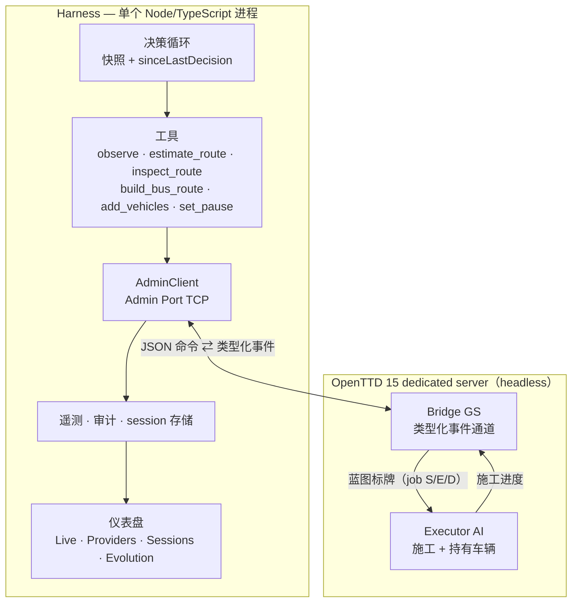

# openttd-agent

[English](README.md) · **简体中文**

[](LICENSE)


> 一个能自己玩 OpenTTD、并被设计成**能从游戏本身学习**的 LLM agent。
>
> 框架提供**事实、因果与协议**，从不提供策略：一局里的每个计划都是模型自己的决定。

本文件只回答一个问题：**我该怎么用？** 它的职责边界由 `AGENTS.md` §9
（职责表）规定——系统事实在 [`SPEC.md`](SPEC.md)，
进度与下一步在 [`ROADMAP.md`](ROADMAP.md)，版本变化在 [`CHANGELOG.md`](CHANGELOG.md)，
过程教训在 [`MEMORY.md`](MEMORY.md)。本文不复制它们的任何内容，只给指针。

---

## 为什么是现在这个结构

OpenTTD 是**连续仿真**（tick 驱动），LLM 是**慢速离散推理**（一次决策 1–30 秒）。
其余设计都是这个矛盾的结果：

- **给模型工具，而不是提线绳。** 它观察、估算、下单建线、管理车队——通过能**回读结果**
  的工具完成。
- **游戏内 AI 是它的手。** Admin Port 只能暂停/存档/启脚本，**不能铺路**；所以游戏内常驻
  一个 Bridge Game Script 与一个 Executor AI，由框架通过 Admin Port 驱动。
- **模型思考时世界继续运行。** 不冻结游戏，而是在每个决策点给出**快照 + 自上次决策
  以来全部变化**，让模型能看见自己动作的效果。

## 架构



读代码前值得记住的两条事实（细节见 `SPEC.md` §10）：

1. **RCON 玩不了游戏。** 它只做服务器级操作——暂停、存档、`say`、`start_ai`。铺路、
   建站、买车必须用游戏内 Squirrel API，Executor AI 因此存在。
2. **每个命令都是排队执行，而不是"假定成功"。** 命令走 模型 → 框架 → GS → Executor，
   Executor 按**提交顺序（FIFO）**执行。决策慢只会让施工延后，**不会静默丢失**。

## 目前可用

| 能力 | 状态 |
|---|---|
| 观测 | Admin Port 事件 + GS 富状态（城镇、经济、线路经济）|
| 决策循环 | 快照 → 模型 → 工具 → 排队命令 → 事件回灌；带截止与决策上限 |
| 类型化 GS 通道 | 契约校验的事件（`gs-events.ts`），替代字符串解析 |
| 线路经济 | 每条线的车辆数、乘客等待、当年利润，并送达模型 |
| 记忆 | 确定性线路事实 + 反思 lessons，跨局持久化；`--no-memory` 供对照 |
| 仪表盘 | Live 实时视图、provider 目录、历史局、evolution 视图 |
| 实验脚手架 | 一条命令跑 A/B 矩阵；两臂不可比时**拒绝下结论** |
| 每局存档 | 每局自动存档，可用 OpenTTD 客户端载入回看 |

## 快速开始

### 前置

- **Node ≥ 22.19** 与 **pnpm**
- **OpenTTD 15**（dedicated server 构建即可）。框架用**隔离 data dir** 启动游戏，
  **绝不触碰**你的全局 OpenTTD 配置。
- agent 模式需要一个 OpenAI 兼容的 LLM 端点（任何 provider 都行；面板内置 39 个 provider 目录）。

### 安装

```bash
git clone https://github.com/green-dalii/openttd-agent.git
cd openttd-agent
pnpm install
```

无需构建步骤：游戏侧脚本包在启动时从 `src/game/squirrel/` 复制到沙箱 data dir。

### 指向你的 OpenTTD

```bash
export OPENTTD_BINARY="/path/to/OpenTTD.app/Contents/MacOS/openttd"
export OPENTTD_DATA_DIR="/tmp/openttd-agent-data"     # 沙箱：配置、存档、session
pnpm run cli --dry-run                                # 打印解析后的配置，不启动任何进程
```

### 运行

```bash
# 只看不打：驱动内置 CPU AI 并观察仪表盘（无 LLM、无 token）
pnpm run cli --watch --seed 7 --web-port 8187

# agent 上场：需要先配置 LLM
pnpm run cli --agent --seed 7 --demo-seconds 300 --web-port 8187

# 同上，但页面可 开始/停止/暂停/恢复
pnpm run cli --serve --web-port 8187
```

| 模式 | 需要 LLM | 你能控制 | 说明 |
|---|---|---|---|
| `--watch` | 否 | 只有 Ctrl-C | 观测内置 AI。**token 面板为空是正常的** |
| `--agent` | 是 | 只有 Ctrl-C | 完整循环：token、工具调用、阶段画面、局末存档 |
| `--serve` | 是 | 页面可 开始/停止/暂停/恢复 | 也可在 agent / watch 间切换 |
| `--v02` | 否 | 只有 Ctrl-C | 脚本化蓝图演示——不接模型也能验管道 |
| `--probe` | 否 | — | 最小 Admin Port 探测，打印规范化事件后退出 |

常用开关：`--no-memory`（从零开始，即对照组）、`--freeze`（模型思考期间暂停世界；
实测要付吞吐代价，见 `SPEC.md` §10.61）、`--add-vehicles N`（v02 基线探针）。

### 配置模型

用面板 **Providers** 页（写入 `<OPENTTD_DATA_DIR>/llm.json`），或设环境变量——
**显式环境变量覆盖文件**：

| 变量 | 默认 | 含义 |
|---|---|---|
| `LLM_BASE_URL` | *(空)* | OpenAI 兼容 base URL；空 = 未配置 |
| `LLM_MODEL` | *(空)* | 模型 id，如 `gpt-4o-mini` |
| `LLM_API_KEY` | *(空)* | API key（别名：`OPENAI_API_KEY`、`ANTHROPIC_API_KEY`）|
| `LLM_API` | `openai-completions` | 流式 API：`openai-completions` 或 `anthropic-messages` |
| `LLM_SOURCE` | *(自动)* | `catalog`（内置 provider）或 `custom`（自建端点）|

| 变量 | 默认 | 含义 |
|---|---|---|
| `OPENTTD_BINARY` | 由 `$HOME` 推导的 macOS Steam 路径 | OpenTTD 可执行文件 |
| `OPENTTD_DATA_DIR` | `/tmp/openttd-agent-data` | 隔离的游戏 data dir |
| `OPENTTD_ADMIN_PORT` / `OPENTTD_GAME_PORT` | `3977` / `3979` | 端口 |
| `OPENTTD_ADMIN_PASSWORD` | `openttd-admin` | Admin 密码（写入沙箱配置）|
| `OPENTTD_SEED` | 随机 | 地图种子（可复现）|
| `OPENTTD_START_YEAR` | `1950` | 开局年份 |
| `OPENTTD_MAP_SIZE` | `small` | `small` / `medium` / `large` = 256 / 512 / 1024 |

agent 模式在模型不可用时会**拒绝启动**，而不是悄悄跑脚本化演示；确实想要后者时传
`--offline-demo`。

## 实验脚手架

这个仓库是用来**测量** agent 的，不只是看它玩。三件套：

```bash
# 一条命令跑完 A/B 矩阵：5 局对照 + 5 局处理，交替执行
pnpm exec tsx scripts/run-experiment.ts --dir /tmp/ab --n 5 --demo-seconds 500 --seed 7
#   --vary memory（默认）处理臂 = 注入记忆，对照臂 = --no-memory
#   --vary freeze         处理臂 = 决策期冻结，两臂都 --no-memory

pnpm exec tsx scripts/loop-health.ts /tmp/ab      # 决策数/局、触发分布、空转率
pnpm exec tsx scripts/m3-verdict.ts /tmp/ab       # 出判定（含混杂守卫）
grep -E "RESULT" /tmp/ab/*.log                    # 每局一行
```

判定会说什么、不会说什么：

- 两臂来自**实验分配**，绝不从"注入了多少"反推（否则首局 treatment 会被算进对照）。
- `money` / `income` **只在两臂建成率相同时**才比较——没建成的局没花钱，钱反而更多。
- 主判据是**运出的货物量（delivered）**，并在均值旁并列三个同伴统计量：
  障碍率（有交付的局占比）的 **Fisher 精确检验**、**Mann–Whitney 秩检验**、
  **自助法置信区间**。该结果是零膨胀重尾量，在这种分布上均值是最吵的摘要，
  甚至可能与中位数**符号相反**。
- 每局都会把存档写到 `<dataDir>/save/`，任何结论都可以**载入真实游戏**核对。

> 这里**力量比 p 值重要**：在实测分布上，本项目早期那些 5v5 比较的力量只有约
> 8–20%。因此 README 在任何结果旁都要报"这个效应需要多少局"——见 `SPEC.md` §10.62。

## 文档地图

| 文档 | 唯一职责 | 不含 |
|---|---|---|
| [`SPEC.md`](SPEC.md) | 系统是什么 + 已验证的系统事实 | 进度、用法、教训 |
| [`ROADMAP.md`](ROADMAP.md) | 未完成的计划与下一步 | 已发布细节、历史 |
| [`CHANGELOG.md`](CHANGELOG.md) | 每个版本改了什么 | 计划、规范 |
| [`MEMORY.md`](MEMORY.md) | 过程教训 + 当前方向 | 系统事实、规范 |
| [`CONTRIBUTING.md`](CONTRIBUTING.md) | 命令、目录树、开发流程 | 规范（见 `AGENTS.md`）、事实（见 `SPEC.md`）|
| [`AGENTS.md`](AGENTS.md) | 工程规范——以上全部职责的权威 | 系统细节、历史 |
| [`NOTICE`](NOTICE) | 第三方库及其许可 | — |

## 已知边界

明确写出来，因为**边角可读的脚手架才有用**：

- **目前不存在赚钱策略**（默认地图与贷款参数下）：每一局公司都在亏钱，尽管货物
  **确实在运**。是改目标（吞吐量而非利润）还是改场景，是记在 `ROADMAP.md` 的开放问题。
- **短局被施工时序主导**：500 秒一局时约 **70% 的局零交付**，通常是线路建成太晚、
  来不及产生效果。
- **模拟速度不可调**：dedicated server 没有任何速度设置或控制台命令
  （`SPEC.md` §10.59）。局长只能线性换墙钟，所以本框架报**统计力量**而不只是结果。
- **仪表盘已冻结**：只修 bug、不加功能，直到研究闭环可靠。
- **一次只跑一个真机实验**：`pnpm run gate` 会断言端口空闲，因此实验运行期间不能跑门禁
  ——这是**记录在案的约束**，不是绕过去的问题。

## 开发

```bash
pnpm run gate          # typecheck + lint（0 警告）+ vendor 校验 + 全量测试
pnpm test              # 快速单测，不碰真机
pnpm run test:live     # 带 @live 的真机集成测试（需 OpenTTD + 可写 data dir）
```

命令、目录结构与提交清单见 [`CONTRIBUTING.md`](CONTRIBUTING.md)；
改系统的规范见 [`AGENTS.md`](AGENTS.md)。

## 许可

MIT —— 见 [`LICENSE`](LICENSE)。第三方声明见 [`NOTICE`](NOTICE)。OpenTTD 本体为
GPLv2，且**不随本仓库分发**：框架只通过 Admin Port 驱动你自己安装的游戏。
